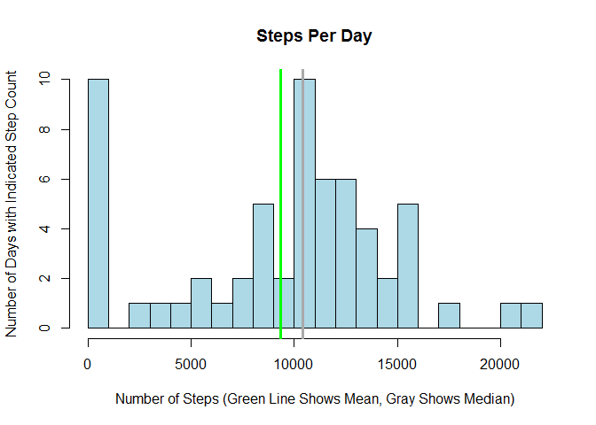
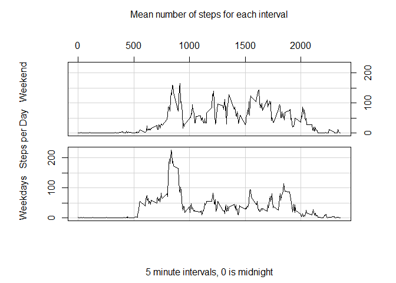

# Reproducible Research: Peer Assessment 1

This investigates step counts, aggregated to 5 minute intervals.

## Loading and preprocessing the data


```r
library(data.table) # For fread()
StepTimeSeries=fread('activity.csv') # Faster than read.csv so its a good habit to use this.
str(StepTimeSeries)
```

```
## Classes 'data.table' and 'data.frame':	17568 obs. of  3 variables:
##  $ steps   : int  NA NA NA NA NA NA NA NA NA NA ...
##  $ date    : chr  "2012-10-01" "2012-10-01" "2012-10-01" "2012-10-01" ...
##  $ interval: int  0 5 10 15 20 25 30 35 40 45 ...
##  - attr(*, ".internal.selfref")=<externalptr>
```

Note that date was read in as character data. That's OK for our purposes. Also note that step is an int which is OK but that logically it is the name of a 5 minute interval in hhmm format.

## What is mean total number of steps taken per day?

This analysis assumes that days for which the data are missing are days in which no steps were taken.

```r
StepsPerDay = StepTimeSeries[,sum(steps,na.rm=T),by=date]
MeanStepsPerDay=StepsPerDay[,mean(V1)]
MedianStepsPerDay=StepsPerDay[,median(V1)]
hist(StepsPerDay$V1,breaks=20,main='Steps Per Day',
     xlab='Number of Steps (Green Line Shows Mean, Gray Shows Median)',
     ylab='Number of Days',col='lightblue')
abline(v=MeanStepsPerDay,col='green',lwd=3)
abline(v=MedianStepsPerDay,col='darkgrey',lwd=3)
```

 

Given that assumption, the histogram above shows for how many days each approximate count of steps was recorded.

The median day recorded 10395 steps and the mean number of steps per day was 9354. These are shown by the vertical lines on the above plot.

## What is the average daily activity pattern?


```r
StepsPerInterval = StepTimeSeries[,sum(steps,na.rm=T),by=interval]
invisible(StepsPerInterval[,StepsPerIntervalPerDay:=V1/nrow(StepsPerDay)])
with(StepsPerInterval,plot(interval,StepsPerIntervalPerDay,type='l',xlab='5 minute intervals, 0 is midnight',
                           ylab='Steps per Day',main='Mean number of steps for each interval'))
```

 

```r
MaxStepsInterval = StepsPerInterval$interval[which.max(StepsPerInterval$StepsPerIntervalPerDay)]
```

The 5 minute interval with the highest average step count per day is 835 which is more conventionaly displayed as 8:35 (h:mm). lol, perhaps that corresponds to the daily dog walk.

## Imputing missing values


```r
NumStepNA = sum(StepTimeSeries[,is.na(steps)])
NumNA = sum(is.na(StepTimeSeries)) # For the entire TimeSeries
```

There are 2304 NA values in steps and also 2304 NA values in the entire dataset so that is the number of rows with NA values.

That's a lot of NAs! So the results reported here so far are skewed. To reduce this bias, fill in each NA with the mean for its interval over the non NA values.


```r
NonNATimeSeries = StepTimeSeries[!is.na(StepTimeSeries$step)]
NonNAStepsPerInterval = NonNATimeSeries[,sum(steps),by=interval]
invisible(NonNAStepsPerInterval[,NonNAStepsPerIntervalPerDay:=V1/nrow(StepsPerDay)])
setkey(StepTimeSeries,interval) # So we can join on interval
ImputeTS = StepTimeSeries[NonNAStepsPerInterval]
invisible(ImputeTS[,ImputedSteps:=NonNAStepsPerIntervalPerDay])
ImputeTS$ImputedSteps[!is.na(ImputeTS$steps)] = ImputeTS$steps[!is.na(ImputeTS$steps)]
# Now repeat the earlier analysis but include the imputed values instead of 0 for NA
NonNAStepsPerDay = ImputeTS[,sum(ImputedSteps),by=date]
NonMeanStepsPerDay=NonNAStepsPerDay[,mean(V1)]
NonMedianStepsPerDay=NonNAStepsPerDay[,median(V1)]
hist(NonNAStepsPerDay$V1,breaks=20,main='Steps Per Day with Imputation for NAs',
     xlab='Number of Steps (Green Line Shows Mean, Gray Shows Median)',
     ylab='Number of Days',col='lightblue')
abline(v=NonMeanStepsPerDay,col='green',lwd=3)
abline(v=NonMedianStepsPerDay,col='darkgrey',lwd=3)
```

 

With the imputed values replacing the missing values, the median day recorded 10395 steps and the mean number of steps per day was 10581. These are shown by the vertical lines on the above plot. The median didn't change with the imputation but now the mean is higher than the median, rather than lower!


## Are there differences in activity patterns between weekdays and weekends?

Let's plot the steps per interval on stacked plots, one for weekend days and the other for weekday days, to find out.


```r
ImputeTS$DayOfWeekType = factor(as.integer(as.POSIXlt(ImputeTS$date)$wday %in% c(0,6)))
levels(ImputeTS$DayOfWeekType) = c('Weekday','Weekend')
StepsPerIntervalAndDoWT = ImputeTS[,sum(ImputedSteps),by='interval,DayOfWeekType']
StepsPerDay$DayOfWeekType = factor(as.integer(as.POSIXlt(StepsPerDay$date)$wday %in% c(0,6)))
levels(StepsPerDay$DayOfWeekType) = c('Weekday','Weekend')
DoWTCounts = StepsPerDay[,.N,by=DayOfWeekType]
setkey(StepsPerIntervalAndDoWT,DayOfWeekType)
invisible(StepsPerIntervalAndDoWT[DoWTCounts,Ave:=V1/N])
with(StepsPerIntervalAndDoWT,coplot(Ave~interval|DayOfWeekType,type='l',show.given=F,columns=1,
                                    ylab='Weekdays   Steps per Day   Weekend',
                                    main='Mean number of steps for each interval',
                                    xlab='5 minute intervals, 0 is midnight'))
```

 

Yes, the pattern is quite different when comparing weekdays to weekends. Weekends tend to require fewer steps, but show a higher spike than weekdays.
